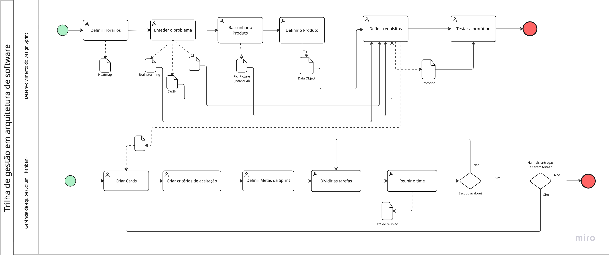

# Carona Amiga FCTE

<p align="center">
	
</p>

<p align="center">
	Projeto acadêmico da disciplina <strong>Arquitetura e Desenho de Software (FGA0208)</strong> - UnB/FCTE (2026.1)
</p>

## Sobre o projeto

O **Carona Amiga FCTE** é uma iniciativa para apoiar o compartilhamento de caronas entre estudantes da UnB/FCTE, com foco em:

- Redução de custos de deslocamento;
- Aumento de segurança e confiança entre usuários;
- Melhoria da mobilidade para ida e volta do campus.

Este repositório concentra os artefatos da **Entrega 01 (Base)**, incluindo design sprint, artefatos generalistas, modelagem BPMN, iniciativas extras e atas.

## Acesso rápido

- Documentação principal: [docs/README.md](docs/README.md)
- Página inicial da base: [docs/Base/1.Base.md](docs/Base/1.Base.md)
- Código de conduta: [CODE_OF_CONDUCT.md](CODE_OF_CONDUCT.md)
- Guia de contribuição: [CONTRIBUTING.md](CONTRIBUTING.md)
- Site da documentação (GitHub Pages): [Carona Amiga FCTE Docs](https://unbarqdsw2026-1-turma02.github.io/2026.1-T02-G7_CaronaAmigaFCTE_Entrega_01/#/)

## Prévia visual

### Rich Picture


### Trilha de gestão em arquitetura de software



## Equipe

| Foto | Matrícula | Aluno |
| :--: | :--: | :--: |
|  | 222022046 | [Ana Victória Guedes da Costa](https://github.com/navicg) |
|  | 221022284 | [Gabriel Henrique Rodrigues de Lima](https://github.com/gabrielhrlima) |
|  | 222008691 | [Gustavo Ribeiro Linhares](https://github.com/GustavoLinharess) |
|  | 222006113 | [João Marcos Moraes de Andrade](https://github.com/JJOAOMARCOSS) |
|  | 221022337 | [João Vitor Santos de Oliveira (Líder)](https://github.com/Jauzimm) |
|  | 222006267 | [Karoline Luz da Conceição](https://github.com/KarolineLuz) |
|  | 222025843 | [Luiza da Silva Pugas](https://github.com/luizaxx) |
|  | 211062348 | [Nicolas Bomfim Dias Bandeira](https://github.com/NickGehjk) |
|  | 222007086 | [Pedro Henrique Faria da Mota](https://github.com/PhFariaa) |
|  | 222037620 | [Wanjo Christopher Paraizo Escobar](https://github.com/wChrstphr) |

## Como executar a documentação localmente

Este repositório utiliza **Docsify** para servir a documentação.

1. Instale o Docsify CLI:

```bash
npm i docsify-cli -g
```

2. Na raiz do repositório, execute:

```bash
docsify serve docs
```

3. Acesse no navegador:

```text
http://localhost:3000
```

## Histórico de versões

| Versão | Data | Descrição | Autor(es) | 
| :----: | :--: | --------- | ----------- |
| 1.0 | 05/04/2026 | Criação do README | [Wanjo Christopher Paraizo Escobar](https://github.com/wChrstphr) | 
