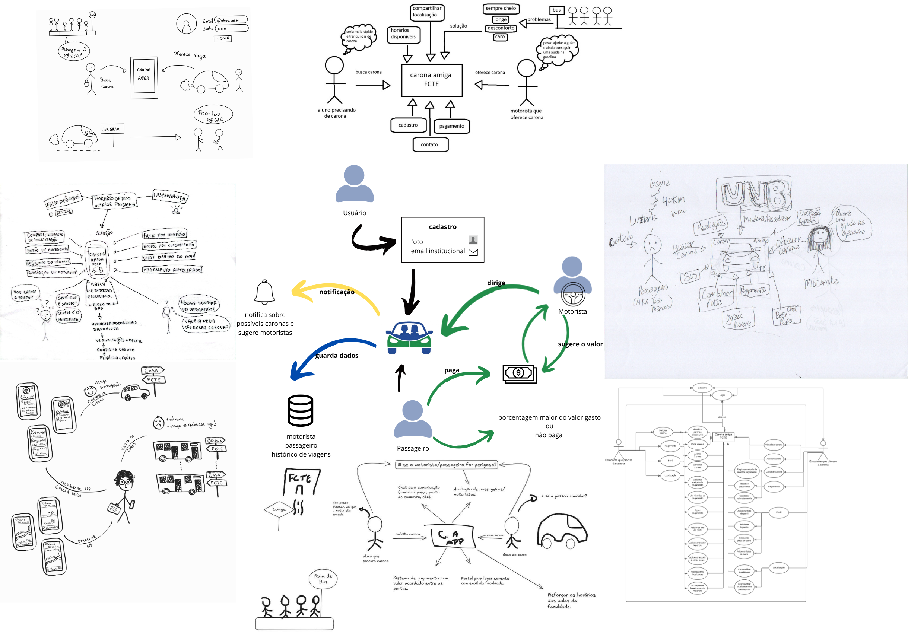

# Design Sprint – Esboçar (Sketch)

## Introdução

A etapa de Sketch (Solution Sketch) no Design Sprint tem como objetivo expandir e aprofundar ideias de solução de forma individual, transformando conceitos iniciais em propostas mais claras e completas.

Segundo o guia de Design Sprint da Google Ventures, a etapa de Sketch é importante para ampliar o repertório de alternativas antes da tomada de decisão em grupo, permitindo que diferentes perspectivas sejam exploradas com mais qualidade.
<a href="#/Base/1-Design-Sprint/1.1.2.Sketch?id=referencias-bibliograficas-1">[1]</a>

## Objetivos

- Ouvir todos os membros antes de decidir algo;
- Coletar diferentes perspectivas de solução do problema em mãos;
- Preparar artefato para a próxima etapa `Decision`;
- Utilizar a etapa [Unpack](../Base/1-Design-Sprint/unpack.md) com os artefatos **[Brainstorming](../Base/2-Artefato-Generalista/Brainstorm.md)**, **[5W2H](../Base/2-Artefato-Generalista/5W2H.md)** e **[Benchmarking](../Base/2-Artefato-Generalista/Benchmarking.md)** como referência. 

## Metodologia

Nesta etapa, cada integrante produziu um **sketch individual** usando a técnica de **Rich Picture** como base de representação. A ideia foi transformar o entendimento consolidado na fase **[Unpack](unpack.md)** em propostas visuais, explorando alternativas de solução antes da convergência do grupo.

Como insumo, os participantes utilizaram os artefatos produzidos anteriormente:
- **[Brainstorming](../2-Artefato-Generalista/Brainstorm.md)**
- **[5W2H](../2-Artefato-Generalista/5w2h.md)**
- **[Benchmarking](../2-Artefato-Generalista/Benchmarking.md)**

A dinâmica seguiu, em linhas gerais, o fluxo abaixo:
1. **Revisão do contexto**: cada participante revisitou os principais pontos do Unpack (objetivo do produto, público-alvo, dores e restrições).
2. **Construção do Rich Picture (individual)**: elaboração de uma visão ampla do sistema, incluindo atores, interações, fluxos de informação, regras do “combinado” e pontos críticos (segurança, cancelamento e comunicação).
3. **Apoio com Ishikawa (quando aplicável)**: identificação de possíveis causas-raiz para problemas do domínio (ex.: atrasos, no-show, falta de confiança), para orientar quais mecanismos a solução deveria cobrir.
4. **Compartilhamento e discussão**: apresentação dos sketches em grupo para nivelar entendimento e registrar convergências/divergências.
5. **Consolidação para a próxima fase**: os resultados foram organizados para apoiar a etapa **Decision**, onde ocorre a escolha e priorização do caminho de solução.

## Artefatos Produzidos

### [Rich Pictures Individuais (Solution Sketch)](/Base/2-Artefato-Generalista/1.3.RichPicture.md)

Cada integrante elaborou um [Rich Picture](/Base/2-Artefato-Generalista/1.3.RichPicture.md) individual como forma de esboçar a solução e representar:
- quem são os atores principais (motorista, passageiro e contexto da FCTE);
- quais são as interações esperadas (ofertar, buscar, solicitar, aceitar, combinar);
- quais informações mínimas precisam ficar explícitas (rota, horário, ponto de encontro e regras);
- quais mecanismos aumentam confiança e previsibilidade (perfil, avaliações, denúncia, confirmação/cancelamento).

  
<b>Síntese obtida</b>

Os [**Rich Pictures**](/Base/2-Artefato-Generalista/1.3.RichPicture.md) foram elaborados de forma individual pelos integrantes do grupo para ampliar a exploracao de solucoes antes da etapa de decisao. Ao todo, foram registrados 10 diagramas, reunindo diferentes perspectivas sobre o mesmo problema de mobilidade academica.

Em sintese, os artefatos permitiram:
- consolidar os principais atores do dominio (motorista, passageiro e plataforma);
- explicitar o fluxo central da experiencia (ofertar, buscar, solicitar, aceitar, combinar e concluir carona);
- evidenciar informacoes essenciais do combinado (rota, horario, ponto de encontro e regras de cancelamento);
- destacar fatores externos e mecanismos de confianca (validacao institucional, avaliacao de usuarios, seguranca e apoio de GPS).

Foi utilizado um [diagrama de Ishikawa](/Base/2-Artefato-Generalista/DiagramaCausaEfeito.md) como ferramenta complementar para mapear fatores que podem gerar problemas no processo de carona (ex.: comunicação, segurança, infraestrutura, comportamento e tempo). Esse mapeamento ajudou a justificar elementos que apareceram nos sketches (como confirmações, regras de cancelamento e sinais de confiança).

  

              Figura 1: Rich Pictures.
          

Fonte: [Wanjo Christopher Paraizo Escobar](https://github.com/wChrstphr), 2026.

Como resultado, os [**Rich Pictures**](/Base/2-Artefato-Generalista/1.3.RichPicture.md) serviram como base para nivelar o entendimento do grupo e preparar a convergencia da fase [**Decision**](/Base/1-Design-Sprint/1.1.3.Decision.md), com foco em previsibilidade, comunicacao e seguranca.

### [Léxico](/Base/2-Artefato-Generalista/Lexico.md) e [Glossário](/Base/2-Artefato-Generalista/2.1.2.Glossario.md) (Padronização de Termos)

Como apoio à documentação e para reduzir ambiguidades, o grupo também trabalhou com **[léxicos](/Base/2-Artefato-Generalista/Lexico.md)** e um **[glossário](/Base/2-Artefato-Generalista/2.1.2.Glossario.md)** de termos do domínio (ex.: “carona”, “ponto de encontro”, “solicitação”, “confirmação”, “cancelamento”). Esses artefatos servem como referência transversal para as próximas fases e demais documentos.

  
<b>Síntese do léxico</b>

O [Léxico](/Base/2-Artefato-Generalista/Lexico.md) foi construído para consolidar uma linguagem comum do domínio Carona Amiga FCTE e reduzir ambiguidades entre os integrantes do projeto. A partir dos insumos de Brainstorm e Rich Picture, os termos recorrentes foram identificados, classificados e descritos segundo o padrão do LAL.

Em síntese, o artefato contemplou:
- levantamento de termos centrais do domínio (atores, objetos, ações e estados);
- classificação por tipo de símbolo: **Verbo**, **Objeto** e **Estado**;
- descrição de cada termo por **Noção** (significado no contexto) e **Impacto** (efeitos e usos no sistema);
- revisão coletiva para padronização de nomenclatura, eliminação de ambiguidades e consolidação de relações entre termos.

Como resultado, o [Léxico](/Base/2-Artefato-Generalista/Lexico.md) fortaleceu a rastreabilidade conceitual do projeto, apoiando a modelagem, a documentação e a preparação para decisões da fase [**Decision**](/Base/1-Design-Sprint/1.1.3.Decision.md) com maior consistência terminológica.

  
<b>Síntese do glossário</b>

O [Glossário](/Base/2-Artefato-Generalista/2.1.2.Glossario.md) foi elaborado para padronizar e tornar explícito o vocabulário utilizado no projeto CaronaAmigaFCTE, reduzindo ambiguidades e promovendo consistência entre os artefatos de documentação.

Em síntese, o artefato contemplou:
- levantamento incremental de termos recorrentes nos artefatos do projeto;
- normalização de variações de escrita, siglas e sinônimos para manter um termo preferencial;
- definição objetiva dos conceitos, com linguagem clara para novos leitores;
- classificação dos termos por tipo conceitual (**Sujeito**, **Objeto**, **Verbo** e **Estado**);
- validação com a equipe para garantir alinhamento semântico e evitar conflitos de interpretação;
- disponibilização em formato interativo HTML para consulta rápida e busca por termos.

Como resultado, o [Glossário](/Base/2-Artefato-Generalista/2.1.2.Glossario.md) complementa o [Léxico](/Base/2-Artefato-Generalista/Lexico.md), reforçando a comunicação entre os membros da equipe e apoiando decisões de modelagem e de requisitos na fase **Decision**.

---

## Referências Bibliográficas

> <a id="referencias-bibliograficas-1">1.</a> Google Ventures. The Design Sprint: Methodology Overview. Disponível em: https://designsprintkit.withgoogle.com/methodology/overview. Acesso em: 31 mar. 2026.

> <a id="referencias-bibliograficas-2">2.</a> BetterEvaluation. Rich pictures. Disponível em: https://www.betterevaluation.org/methods-approaches/methods/rich-pictures. Acesso em: 31 mar. 2026.

## Histórico de Versões

| Versão | Data | Descrição | Autor(es) | Revisor(es) | Detalhes da revisão |
| :----: | :--: | --------- | ----------- | ------ | :---: |
| 1.0  | 31/03/2026 | Criação do documento [#33](https://github.com/UnBArqDsw2026-1-Turma02/2026.1-T02-G7_CaronaAmigaFCTE_Entrega_01/issues/33) | [Wanjo Christopher Paraizo Escobar](https://github.com/wChrstphr) | [João Marcos Moraes de Andrade](https://github.com/JJOAOMARCOSS) | Ajustes realizados |
| 1.1  | 03/04/2026 | Criação do documento [#33](https://github.com/UnBArqDsw2026-1-Turma02/2026.1-T02-G7_CaronaAmigaFCTE_Entrega_01/issues/33) | [João Marcos Moraes de Andrade](https://github.com/JJOAOMARCOSS) | [Wanjo Christopher Paraizo Escobar](https://github.com/wChrstphr) | Artefato revisado e incrementado com melhorias |
| 1.2  | 03/04/2026 | Adição da sintese dos Rich Pictures, Léxico e Glossário na seção de Sketch [#33](https://github.com/UnBArqDsw2026-1-Turma02/2026.1-T02-G7_CaronaAmigaFCTE_Entrega_01/issues/33) | [Wanjo Christopher Paraizo Escobar](https://github.com/wChrstphr) | [João Marcos Moraes de Andrade](https://github.com/JJOAOMARCOSS) | - |