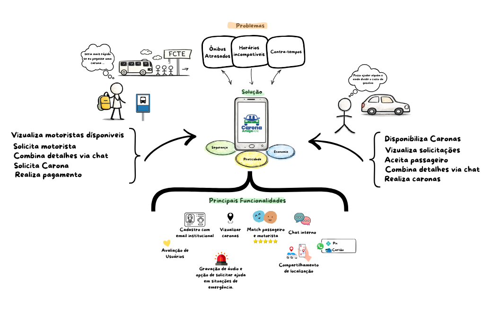
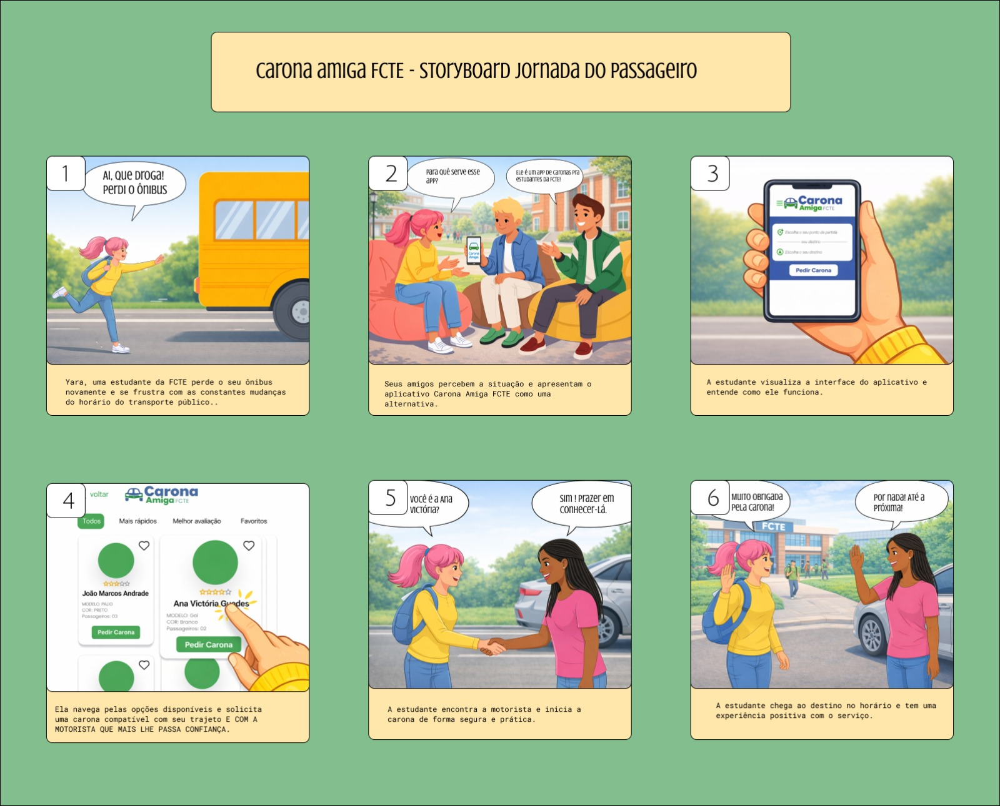

# Decision

## Introdução

O Design Sprint é uma metodologia estruturada, proposta pela Google Ventures, que visa acelerar o processo de concepção, prototipação e validação de soluções em um curto espaço de tempo, geralmente cinco dias. Essa abordagem combina práticas de design thinking, prototipação rápida e validação com usuários, permitindo que equipes multidisciplinares explorem problemas complexos e testem ideias de forma eficiente e colaborativa <a href="#/Base/1-Design-Sprint/1.1.3.Decision?id=referencias-bibliograficas-1">[1]</a>.

Ao longo do Design Sprint, o processo é dividido em etapas bem definidas, que incluem a compreensão do problema (_Unpack_), a geração de ideias (_Sketch_), a tomada de decisão (_Decision_), a prototipação (_Prototype_) e a validação (_Test_). Cada uma dessas fases possui um papel fundamental na construção de soluções centradas no usuário.

Dentre essas etapas, a fase de _Decision_ destaca-se como um momento crítico, no qual a equipe analisa, discute e seleciona as melhores ideias geradas anteriormente. Essa etapa tem como objetivo convergir as diferentes propostas em uma solução viável, alinhada aos objetivos do projeto e às necessidades dos usuários. Para isso, são utilizadas técnicas de votação, priorização e discussão estruturada, garantindo que a decisão final seja coletiva, justificada e estratégica <a href="#/Base/1-Design-Sprint/1.1.3.Decision?id=referencias-bibliograficas-2">[2]</a>.

Além de orientar o direcionamento do protótipo, a fase de decisão reduz incertezas e evita desperdício de esforço em ideias pouco promissoras, tornando o processo mais assertivo. Dessa forma, ela atua como um ponto de transição entre a exploração criativa e a execução prática, consolidando o caminho que será seguido nas etapas subsequentes do Design Sprint.

---

## Objetivos

- Consolidar, na etapa de _Decision_, uma visão unificada da solução proposta a partir dos artefatos produzidos pela equipe;
- Integrar os diferentes Rich Pictures elaborados pelos membros em um **Rich Picture geral**, representando de forma coesa o contexto do sistema;
- Definir e comunicar, por meio de abordagens visuais, os principais fluxos de interação do sistema CaronaAmiga FCTE;
- Elaborar dois storyboards complementares, contemplando as diferentes perspectivas de uso:
  - Jornada do passageiro (solicitação de carona);
  - Jornada do motorista (oferta de carona);
- Apoiar o processo de tomada de decisão quanto às melhores ideias e fluxos a serem seguidos no desenvolvimento do protótipo;
- Identificar inconsistências, lacunas e oportunidades de melhoria antes da etapa de prototipação;
- Promover alinhamento entre os membros da equipe quanto ao funcionamento do sistema e à experiência dos usuários;
- Garantir maior clareza, coesão e direcionamento estratégico para as próximas etapas do Design Sprint.

## Metodologia

A etapa de _Decision_ foi conduzida com o objetivo de **convergir as ideias geradas anteriormente** em uma solução estruturada e validada pela equipe. Para isso, foram utilizados dois principais artefatos visuais: o **Rich Picture** e os **Storyboards**, construídos com apoio da ferramenta **Figma**, que possibilita colaboração e visualização integrada das propostas.

Inicialmente, foi realizada a análise dos Rich Pictures desenvolvidos individualmente pelos membros da equipe. A partir dessa análise, procedeu-se à **síntese dessas visões em um Rich Picture geral**, consolidando os principais elementos do sistema, como atores, interações, problemas e contextos envolvidos. Esse artefato serviu como base para a tomada de decisão, permitindo uma compreensão ampla e compartilhada do sistema.

Em seguida, visando detalhar os fluxos de interação e apoiar a escolha das melhores soluções, foram elaborados **dois storyboards complementares**, cada um representando uma perspectiva distinta do sistema:

- **Storyboard do passageiro**: focado na jornada do usuário que busca uma carona;
- **Storyboard do motorista**: focado na jornada do usuário que oferece a carona.

Essa divisão foi adotada para evitar ambiguidades e garantir maior fidelidade às experiências específicas de cada tipo de usuário, permitindo uma análise mais precisa das funcionalidades e interações.

A construção dos artefatos seguiu as seguintes etapas:

- Análise e comparação dos Rich Pictures individuais produzidos pela equipe;
- Síntese das informações em um **Rich Picture geral consolidado**;
- Identificação dos principais atores do sistema (motorista e passageiro);
- Definição dos cenários de uso mais relevantes para cada perfil de usuário;
- Estruturação dos fluxos de interação com base no Rich Picture geral;
- Elaboração dos storyboards (passageiro e motorista), representando as jornadas completas;
- Representação visual das ações, telas e interações em cada etapa dos fluxos;
- Revisão colaborativa dos artefatos para validação das decisões tomadas;
- Ajustes finais visando garantir coerência, clareza e alinhamento com os objetivos do projeto.

Dessa forma, a utilização conjunta do Rich Picture e dos Storyboards permitiu não apenas representar a solução, mas também **orientar a tomada de decisão de forma visual, colaborativa e estruturada**, fortalecendo a transição para a etapa de prototipação.

## Rich Picture

O Rich Picture é uma técnica de modelagem utilizada na Engenharia de Software e na Soft Systems Methodology que permite representar visualmente sistemas complexos de forma holística, evidenciando seus principais componentes, relações e interações <a href="#/Base/1-Design-Sprint/1.1.3.Decision?id=referencias-bibliograficas-3">[3]</a>.

No projeto Carona Amiga FCTE, essa técnica é empregada para ilustrar o ecossistema do aplicativo, destacando a interação entre estudantes motoristas e passageiros, além de fatores externos como validação institucional, segurança e uso de tecnologias como GPS.

Dessa forma, o Rich Picture proporciona uma visão geral do funcionamento do sistema, evidenciando fluxos de informação, processos principais (como pareamento de rotas e definição de pontos de encontro) e contribuindo para o alinhamento da equipe e melhor compreensão da solução proposta <a href="#/Base/1-Design-Sprint/1.1.3.Decision?id=referencias-bibliograficas-4">[4]</a>.

### Apresentação do Rich Picture Geral

O Rich Picture desenvolvido apresenta uma visão geral do sistema Carona Amiga FCTE, destacando seus principais elementos, atores e interações, com foco em:

- **Problemas Identificados:** Dificuldades enfrentadas pelos estudantes com o transporte público, como ônibus atrasados, horários incompatíveis e contratempos no deslocamento até a FCTE.
- **Atores do Sistema:** Representação dos usuários envolvidos, sendo passageiros (que solicitam caronas) e motoristas (que disponibilizam vagas).
- **Solução Proposta:** O aplicativo Carona Amiga FCTE como alternativa para facilitar o deslocamento, promovendo praticidade, economia e segurança.
- **Interações do Passageiro:** Ações como visualizar motoristas disponíveis, solicitar caronas, combinar detalhes via chat e realizar pagamentos.
- **Interações do Motorista:** Funcionalidades como disponibilizar caronas, visualizar solicitações, aceitar passageiros e gerenciar as viagens.
- **Principais Funcionalidades:** Recursos do sistema, incluindo cadastro com e-mail institucional, sistema de avaliações, chat interno, compartilhamento de localização e botão de emergência.

Abaixo, na figura 1, apresenta-se o Rich Picture do sistema Carona Amiga FCTE:

Figura 1: Rich Picture Geral Carona FCTE

O Rich Picture Geral encontra-se nesse PDF: [PDF](https://drive.google.com/file/d/1YTDVsF5u44teX8qb9dd6LE6F8ryCTbEQ/view?usp=sharing)

 Fonte: Elaborado pelo(s) autor(es) ([Ana Victória Guedes da Costa](https://github.com/navicg), [João Vitor Santos de Oliveira](https://github.com/Jauzimm) e [Karoline Luz da Conceição](https://github.com/KarolineLuz), 2026)

## Storyboards

O storyboard é uma ferramenta visual utilizada para representar fluxos, cenários e interações de forma clara e organizada, complementando o roteiro ao traduzir ideias em elementos visuais. Essa abordagem facilita a compreensão da solução proposta e contribui para o refinamento das ideias ao longo do processo de desenvolvimento <a href="#/Base/1-Design-Sprint/1.1.3.Decision?id=referencias-bibliograficas-5">[5]</a>.

No contexto do desenvolvimento de software, especialmente em abordagens centradas no usuário, o storyboard permite visualizar jornadas de uso, identificar pontos críticos e validar soluções antes da implementação, tornando o processo mais eficiente e alinhado às necessidades dos usuários <a href="#/Base/1-Design-Sprint/1.1.3.Decision?id=referencias-bibliograficas-6">[6]</a>, <a href="#/Base/1-Design-Sprint/1.1.3.Decision?id=referencias-bibliograficas-7">[7]</a>.

No projeto **CaronaAmiga FCTE**, o storyboard é utilizado para representar as principais interações dos usuários com o sistema, auxiliando na compreensão dos fluxos e promovendo o alinhamento da equipe na construção de uma solução mais clara, intuitiva e centrada no usuário.

### Apresentação do Storyboard da Jornada do Passageiro

O Storyboard desenvolvido apresenta as principais etapas da jornada do passageiro na plataforma Carona Amiga FCTE, com foco em:

- Problema Inicial: A estudante enfrenta dificuldades com o transporte público, perdendo o ônibus e lidando com atrasos frequentes.
- Descoberta da Solução: Amigos identificam o problema e apresentam o aplicativo Carona Amiga FCTE como uma alternativa prática.
- Exploração do Aplicativo: A usuária visualiza a interface do app e compreende seu funcionamento.
- Busca por Caronas: Navegação pelas opções disponíveis, permitindo a escolha com base em critérios como avaliação e confiança.
- Conexão com Motorista: Encontro entre passageira e motorista, iniciando a carona de forma segura e prática.
- Conclusão da Experiência: A estudante chega ao destino no horário e finaliza a jornada com uma experiência positiva.

Abaixo, na figura 2 se encontra o Storyboard:

Figura 2: Storyboard Carona FCTE

O Storyboard da jornada do passageiro encontra-se nesse PDF: [PDF](https://drive.google.com/file/d/1tuBr-OCQRpQNmFj0A6m_1brzuXqO9eeI/view?usp=sharing)

 Fonte: Elaborado pelo(s) autor(es) ([Ana Victória Guedes da Costa](https://github.com/navicg), [Karoline Luz da Conceição](https://github.com/KarolineLuz) e [Luiza da Silva Pugas](https://github.com/Luizaxx), 2026)

---

### Apresentação do Storyboard da Jornada do Motorista

O Storyboard desenvolvido apresenta as principais etapas da jornada do motorista na plataforma Carona Amiga FCTE, com foco em:

- **Início da Jornada:** O estudante Carlos decide utilizar o aplicativo para oferecer carona em sua rota habitual, buscando ajudar outros alunos e obter uma renda extra.
- **Acesso ao Aplicativo:** O motorista abre o app e visualiza a tela inicial, iniciando o processo ao selecionar a opção de oferecer carona.
- **Definição do Trajeto:** Carlos informa seu ponto de partida e destino, permitindo que o sistema trace a melhor rota para sua jornada.
- **Correspondência de Passageiro:** O aplicativo encontra uma passageira compatível, e o motorista pode interagir via chat para alinhar detalhes do encontro.
- **Encontro e Início da Carona:** Motorista e passageira se encontram em um ponto próximo à FCTE, confirmam as informações e iniciam a viagem.
- **Conclusão da Experiência:** A carona é realizada de forma segura e eficiente, resultando em uma experiência positiva para ambos.

Abaixo, na figura 3 se encontra o Storyboard:

  
  
Figura 3: Storyboard Motorista FCTE 

O Storyboard da jornada do motorista encontra-se nesse PDF: [PDF](https://drive.google.com/file/d/1HXlmsPFTnvvoDET0rPxNz2_7l8QgynHM/view?usp=sharing)

 Fonte: Elaborado pelo(s) autor(es) ([Gabriel Henrique Rodrigues de Lima](https://github.com/gabrielhrlima), [Nicolas Bomfim Dias Bandeira](https://github.com/NickGehjk), 2026)

---

## Validação dos Storyboards

Para a validação dos storyboards produzidos, foi realizada uma reunião com os membros da equipe, com o objetivo de revisar, discutir e alinhar as representações desenvolvidas.

Durante essa validação, foram analisados aspectos como:

- Coerência dos fluxos de interação representados;
- Clareza na distinção entre os papéis de motorista e passageiro;
- Adequação dos cenários às necessidades do sistema;
- Identificação de possíveis inconsistências ou melhorias.

Abaixo apresenta-se a tabela contendo os participantes envolvidos no processo de validação dos storyboards, bem como suas respectivas funções, data, horário e local em que a validação foi realizada.

Tabela 1: Participantes

|            Aluno             |       Função       |    Data    | Hora  |       Local        |
| :--------------------------: | :----------------: | :--------: | :---: | :----------------: |
| [Nome do Aluno](link-github) | Função no artefato | DD/MM/YYYY | HH:MM | Local da validação |

Fonte: [Nome do Responsável], YYYY.

## [Nome do Artefato]

[Insira as comprovações de que o artefato foi feito, imagens prints e links.]

## Gravação da reunião de [Nome do Artefato] (Opcional)

[Inserir o embedded link para o YouTube do vídeo publicado.]

---

## Conclusão

---

## Referências Bibliográficas

> <a id="referencias-bibliograficas-1">1.</a> KNAPP, Jake; ZERATSKY, John; KOWITZ, Braden. **Sprint: How to Solve Big Problems and Test New Ideas in Just Five Days**. New York: Simon & Schuster, 2016.

> <a id="referencias-bibliograficas-2">2.</a> GOOGLE VENTURES. **Design Sprint Kit: Methodology Overview**. Disponível em: https://designsprintkit.withgoogle.com/methodology/overview. Acesso em: 01 abr. 2026.

> <a id="referencias-bibliograficas-3">3.</a> CHECKLAND, Peter; SCHOLES, Jim. **Soft Systems Methodology in Action**. Chichester: Wiley, 1990.

> <a id="referencias-bibliograficas-4">4.</a> PRESSMAN, Roger S.; MAXIM, Bruce R. **Engenharia de Software: Uma Abordagem Profissional**. 8. ed. Porto Alegre: AMGH, 2016.

> <a id="referencias-bibliograficas-5">5.</a> ANTERO, Kalyenne de Lima; MELO, Matheus Rodrigues de. **Roteiro e Storyboard**. Material didático.

> <a id="referencias-bibliograficas-6">6.</a> PRESSMAN, Roger S.; MAXIM, Bruce R. **Engenharia de Software: Uma Abordagem Profissional**. 8. ed. Porto Alegre: AMGH, 2016.

> <a id="referencias-bibliograficas-7">7.</a> SOMMERVILLE, Ian. **Engenharia de Software**. 10. ed. São Paulo: Pearson, 2019.

---

## Histórico de Versões

| Versão |    Data    | Descrição                                                                                                                                              | Autor(es)                                                   | Revisor(es)                                                       | Detalhes da revisão |
| :----: | :--------: | ------------------------------------------------------------------------------------------------------------------------------------------------------ | ----------------------------------------------------------- | ----------------------------------------------------------------- | :-----------------: |
|  1.0   | 01/04/2026 | Criação do Artefato [#37](https://github.com/UnBArqDsw2026-1-Turma02/2026.1-T02-G7_CaronaAmigaFCTE_Entrega_01/issues/37)                               | [Ana Victória Guedes da Costa](https://github.com/navicg)   | [João Marcos Moraes de Andrade](https://github.com/JJOAOMARCOSS)  |          -          |
|  1.1   | 01/04/2026 | Adicionando Story board do Passageiro [#37](https://github.com/UnBArqDsw2026-1-Turma02/2026.1-T02-G7_CaronaAmigaFCTE_Entrega_01/issues/37)             | [Karoline Luz da Conceição](https://github.com/KarolineLuz) | [Wanjo Christopher Paraizo Escobar](https://github.com/wChrstphr) |          -          |
|  1.2   | 02/04/2026 | Adicionando introdução sobre o Rich Picture Geral [#37](https://github.com/UnBArqDsw2026-1-Turma02/2026.1-T02-G7_CaronaAmigaFCTE_Entrega_01/issues/37) | [Ana Victória Guedes da Costa](https://github.com/navicg)   | [Luiza da Silva Pugas](https://github.com/Luizaxx)                |          -          |
|  1.3   | 02/04/2026 | Adicionando imagem do Rich Picture Geral [#37](https://github.com/UnBArqDsw2026-1-Turma02/2026.1-T02-G7_CaronaAmigaFCTE_Entrega_01/issues/37)          | [Karoline Luz da Conceição](https://github.com/KarolineLuz) | [João Vitor Santos de Oliveira](https://github.com/Jauzimm)       |          -          |
