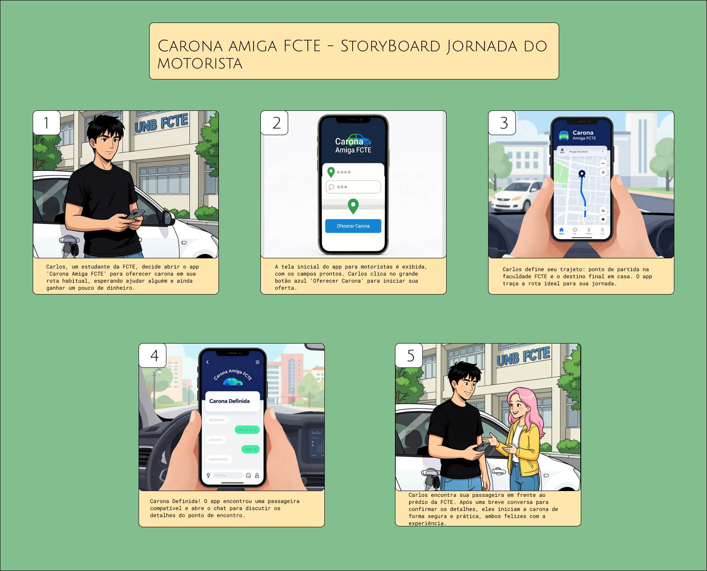

# Storyboards

## Introdução

O storyboard constitui-se como uma ferramenta fundamental no processo de concepção e desenvolvimento de soluções, ampliando as possibilidades oferecidas pelo roteiro ao incorporar elementos visuais que favorecem a comunicação e a compreensão das ideias. Enquanto o roteiro organiza a narrativa em linguagem textual, o storyboard atua como uma representação imagética dessa narrativa, permitindo visualizar cenários, fluxos e interações de forma mais concreta e acessível <a href="#/Base/2-Artefato-Generalista/1.2.6.Storyboards?id=referencias-bibliograficas-1">[1]</a>.

Nesse sentido, storyboard e roteiro não são elementos excludentes, mas complementares. Ambos se retroalimentam ao longo do processo criativo, contribuindo para a construção de soluções mais coerentes e bem estruturadas. A representação visual proporcionada pelo storyboard possibilita identificar lacunas, inconsistências e oportunidades de melhoria ainda nas fases iniciais do projeto, promovendo maior clareza na comunicação entre os membros da equipe e demais stakeholders <a href="#/Base/2-Artefato-Generalista/1.2.6.Storyboards?id=referencias-bibliograficas-1">[1]</a>.

Além disso, por se tratar de um artefato visual, o storyboard exige organização, fluidez e coerência entre seus quadros, garantindo que cada etapa da narrativa contribua para o entendimento do todo. A construção desses quadros deve ser orientada por uma intenção clara de comunicação, evitando descontinuidades que comprometam a interpretação da solução proposta. Dessa forma, o storyboard se consolida como um instrumento essencial tanto no contexto artístico quanto em aplicações técnicas, como o desenvolvimento de software centrado no usuário <a href="#/Base/2-Artefato-Generalista/1.2.6.Storyboards?id=referencias-bibliograficas-1">[1]</a>.

No contexto da disciplina de **Arquitetura e Desenho de Software**, o uso de storyboards está alinhado a metodologias ágeis e centradas no usuário, como o Design Sprint, que incentivam a prototipação rápida e a validação de ideias antes da implementação <a href="#/Base/2-Artefato-Generalista/1.2.6.Storyboards?id=referencias-bibliograficas-2">[2]</a>. Assim, o storyboard atua como uma ponte entre a abstração das ideias e sua materialização em protótipos.

Aplicando esse conceito ao projeto **Carona Amiga FCTE**, um webapp voltado para o compartilhamento de caronas entre estudantes da FCTE/UnB, o storyboard permite representar a jornada dos usuários — tanto passageiros quanto motoristas — evidenciando problemas reais, como dificuldades com transporte público, e apresentando soluções digitais de forma visual e estruturada. Dessa forma, contribui diretamente para a definição de requisitos, melhoria da experiência do usuário e validação das funcionalidades propostas.

---

## Objetivos

A elaboração dos storyboards no contexto da disciplina de **Arquitetura e Desenho de Software** tem como principal objetivo consolidar, de forma visual e estruturada, a solução proposta para o sistema **Carona Amiga FCTE**, promovendo a integração entre os artefatos produzidos ao longo do processo de Design Sprint.

Nesse sentido, busca-se:

- Consolidar, na etapa de _Decision_, uma visão unificada da solução a partir dos artefatos previamente desenvolvidos, como:

  - **[Brainstorming](/Base/2-Artefato-Generalista/Brainstorm.md)**: utilizado para geração e exploração inicial de ideias de forma colaborativa;
  - **[5W2H](/Base/2-Artefato-Generalista/5W2H.md)**: aplicado para estruturar e detalhar o problema e as possíveis soluções de forma organizada;
  - **[Rich Picture](/Base/2-Artefato-Generalista?1.2.5.Richpicture.md)**: empregado para representar visualmente o contexto do sistema, seus atores e interações;
- Traduzir ideias abstratas e conceituais em representações visuais concretas, facilitando a compreensão dos fluxos de interação do sistema;
- Representar, de forma clara e sequencial, as jornadas dos usuários do sistema, considerando suas diferentes perspectivas:
  - Passageiro, responsável por solicitar caronas;
  - Motorista, responsável por ofertar caronas;
- Apoiar a tomada de decisão quanto às melhores soluções, com base na análise crítica dos fluxos representados, conforme proposto na etapa de _Decision_ do Design Sprint;
- Identificar possíveis inconsistências, lacunas ou melhorias ainda nas fases iniciais do projeto, reduzindo riscos durante a prototipação e desenvolvimento;
- Promover alinhamento entre os membros da equipe, garantindo uma compreensão compartilhada do sistema e de suas funcionalidades;
- Contribuir para a construção de uma solução centrada no usuário, evidenciando problemas reais e propondo interações que atendam às necessidades dos estudantes da FCTE.

Dessa forma, os storyboards atuam como um elo entre a ideação e a prototipação, permitindo validar e refinar a solução antes de sua implementação.

---

## Metodologia

A metodologia adotada para a construção dos storyboards está fundamentada na abordagem do Design Sprint, especialmente na etapa de _Decision_, que visa **convergir ideias e estruturar soluções viáveis** a partir dos insumos gerados anteriormente.

Inicialmente, foram analisados os artefatos produzidos nas etapas anteriores, com destaque para o **[Brainstorming](Base/2-Artefato-Generalista/Brainstorm.md)**, que possibilitou a geração de ideias; o **[5W2H](Base/2-Artefato-Generalista/5w2h.md)**, que auxiliou na organização e compreensão do problema e da solução; e o **[Rich Picture](Base/2-Artefato-Generalista/1.3.RichPicture.md)**, que forneceu uma visão sistêmica do contexto, dos atores e das interações envolvidas.

A partir dessa análise, foi possível identificar os principais elementos do sistema, como:

- Atores envolvidos (passageiros e motoristas);
- Problemas enfrentados (dificuldades com transporte público, atrasos, falta de previsibilidade);
- Oportunidades de solução (compartilhamento de caronas entre estudantes);
- Interações essenciais do sistema.

Com base nesses insumos, procedeu-se à construção dos storyboards utilizando a ferramenta **Figma**, escolhida por sua capacidade de colaboração em tempo real e facilidade de representação visual. A utilização de ferramentas visuais nesse processo reforça a importância do storyboard como meio de comunicação e validação de ideias, permitindo antecipar cenários e testar fluxos antes da implementação.

Optou-se pela divisão dos storyboards em duas perspectivas distintas:

- **Storyboard do passageiro**: focado na jornada de busca, seleção e solicitação de caronas;
- **Storyboard do motorista**: focado na oferta, gerenciamento e realização de caronas.

Essa separação permitiu maior clareza na representação dos fluxos e evitou ambiguidades, garantindo que cada tipo de usuário tivesse sua experiência devidamente detalhada.

A construção dos storyboards seguiu um processo estruturado, composto pelas seguintes etapas:

- Consolidação das informações provenientes dos artefatos (Brainstorming, 5W2H e Rich Picture);
- Definição dos cenários de uso mais relevantes para o sistema;
- Estruturação dos fluxos de interação para cada tipo de usuário;
- Organização dos quadros (frames), representando cada etapa da jornada;
- Representação visual das telas, ações e decisões do sistema;
- Garantia de continuidade narrativa e coerência entre os quadros;
- Realização de revisões críticas em equipe, visando identificar inconsistências e oportunidades de melhoria;
- Ajustes finais para assegurar clareza, alinhamento e fidelidade à solução proposta.

Além disso, durante o processo, buscou-se manter uma postura crítica e iterativa, reconhecendo que o storyboard não é apenas um artefato ilustrativo, mas também um instrumento de análise e refinamento da solução. A avaliação contínua dos quadros e de suas transições permitiu garantir maior fluidez e consistência narrativa, aspectos essenciais para a construção de sistemas centrados no usuário.

Portanto, a metodologia adotada evidencia o papel do storyboard como um artefato estratégico no desenvolvimento de software, permitindo transformar ideias em representações visuais estruturadas, apoiar a tomada de decisão e orientar as etapas subsequentes de prototipação e implementação do sistema.

---

## Storyboards

O storyboard é um artefato visual essencial no processo de desenvolvimento de sistemas, especialmente em abordagens centradas no usuário, pois permite representar de forma sequencial, gráfica e estruturada as interações entre os usuários e o sistema. Diferentemente de descrições puramente textuais, o storyboard possibilita a visualização concreta das jornadas, facilitando a compreensão dos fluxos, das decisões e das experiências vivenciadas pelos usuários ao longo da utilização do sistema.

No contexto acadêmico da disciplina de **Arquitetura e Desenho de Software**, o storyboard assume um papel estratégico ao transformar conceitos abstratos, levantados por meio de artefatos como Brainstorming, 5W2H e Rich Picture, em representações visuais tangíveis. Essa transformação permite não apenas comunicar a solução de forma mais clara, mas também analisar criticamente cada etapa da interação, evidenciando pontos de melhoria, inconsistências e requisitos implícitos do sistema.

Além disso, o storyboard contribui diretamente para a construção de uma visão compartilhada entre os membros da equipe, funcionando como um instrumento de alinhamento e validação. Ao observar os quadros e suas transições, é possível avaliar aspectos como fluidez da navegação, clareza das ações do usuário, coerência entre etapas e aderência da solução às necessidades reais do público-alvo. Dessa forma, o storyboard não apenas representa a solução, mas também atua como uma ferramenta analítica e de refinamento do sistema.

No projeto **Carona Amiga FCTE**, os storyboards foram elaborados com o objetivo de representar, de forma detalhada, as jornadas dos principais atores do sistema — passageiros e motoristas — evidenciando suas motivações, interações e resultados ao utilizar o webapp. A construção desses storyboards permitiu compreender de maneira mais profunda o comportamento dos usuários, bem como identificar funcionalidades essenciais, como busca por caronas, definição de rotas, comunicação entre usuários e critérios de confiança.

Optou-se pela divisão dos storyboards em duas perspectivas complementares, permitindo uma análise mais precisa e especializada de cada tipo de interação:

- **Jornada do Passageiro**: focada na busca, seleção e utilização de uma carona;
- **Jornada do Motorista**: focada na oferta, organização e execução da carona.

Essa abordagem contribui para evitar ambiguidades e garantir que as particularidades de cada perfil de usuário sejam devidamente representadas.

Clique nas seções abaixo para visualizar os storyboards detalhados:

---

📖 Storyboard da Jornada do Passageiro

O storyboard da jornada do passageiro representa, de forma narrativa e visual, a experiência de um usuário que enfrenta dificuldades com o transporte público e encontra no sistema uma alternativa eficiente para seu deslocamento.

A construção dessa narrativa evidencia não apenas o fluxo funcional do sistema, mas também aspectos emocionais e contextuais da experiência do usuário, como frustração inicial, descoberta da solução e satisfação ao final da jornada.

As etapas representadas incluem:

- **Contexto e Problema Inicial:** A usuária perde o ônibus, evidenciando um problema recorrente e real;
- **Descoberta da Solução:** A recomendação do aplicativo por outros estudantes introduz o sistema como alternativa;
- **Primeiro Contato com o Sistema:** A interface do aplicativo é explorada, destacando usabilidade e clareza;
- **Processo de Escolha:** A usuária analisa opções de carona com base em critérios de confiança, avaliação e compatibilidade;
- **Interação com o Motorista:** O encontro entre os usuários representa a transição do ambiente digital para o físico;
- **Conclusão da Jornada:** A chegada ao destino reforça o valor da solução proposta.

Esse storyboard evidencia requisitos importantes, como:
- Interface intuitiva;
- Sistema de recomendação e avaliação;
- Segurança e confiança entre usuários;
- Eficiência no deslocamento.

Figura 1: Storyboard Carona FCTE

🔗 Acesse o storyboard completo: [PDF](https://drive.google.com/file/d/1tuBr-OCQRpQNmFj0A6m_1brzuXqO9eeI/view?usp=sharing)

---

🚗 Storyboard da Jornada do Motorista

O storyboard da jornada do motorista apresenta a perspectiva do usuário que oferece caronas, destacando as etapas necessárias para disponibilizar o serviço e interagir com passageiros.

Diferentemente do passageiro, o motorista assume um papel mais ativo na definição da viagem, sendo responsável por configurar rotas, disponibilizar vagas e gerenciar interações.

As etapas representadas incluem:

- **Início da Jornada:** O motorista decide oferecer carona, motivado por conveniência e possível benefício financeiro;
- **Acesso ao Sistema:** Interação com a interface inicial do aplicativo;
- **Definição do Trajeto:** Inserção de origem e destino, permitindo ao sistema calcular a rota;
- **Processo de Correspondência:** Identificação de passageiros compatíveis com a rota;
- **Comunicação e Encontro:** Interação entre motorista e passageiro para alinhamento de detalhes;
- **Execução e Conclusão da Carona:** Realização da viagem com sucesso e experiência positiva.

Esse storyboard evidencia funcionalidades fundamentais do sistema, como:
- Publicação de caronas;
- Definição e otimização de rotas;
- Sistema de correspondência entre usuários;
- Comunicação direta entre motorista e passageiro.

Figura 2: Storyboard Motorista FCTE

🔗 Acesse o storyboard completo: [PDF](https://drive.google.com/file/d/1HXlmsPFTnvvoDET0rPxNz2_7l8QgynHM/view?usp=sharing)

---

## Validação dos Storyboards

Os storyboards desenvolvidos foram submetidos a um processo de validação com os membros da equipe, visando verificar a consistência dos fluxos, a clareza das interações e a aderência às necessidades dos usuários.

Este processo foi fundamental para o refinamento das jornadas representadas e para a identificação de possíveis melhorias antes da etapa de prototipação.

Para evitar redundância entre os artefatos, a descrição completa da validação — incluindo metodologia, perguntas aplicadas e análise dos resultados — encontra-se detalhada na etapa de _Decision_:  
<a href="#/Base/1-Design-Sprint/1.1.3.Decision?id=validacao-dos-storyboards">[Acessar validação completa]</a>.

---

## Conclusão

A utilização dos storyboards no desenvolvimento deste projeto mostrou-se essencial para a construção de uma compreensão mais aprofundada e estruturada das jornadas dos usuários, tanto do passageiro quanto do motorista. Por meio da representação visual sequencial, foi possível não apenas ilustrar a solução proposta, mas também analisar criticamente cada etapa das interações, identificando requisitos implícitos, pontos de melhoria e possíveis inconsistências nos fluxos do sistema.

Além disso, os storyboards contribuíram significativamente para a validação das ideias levantadas ao longo do processo, permitindo verificar, de forma antecipada, a coerência, a fluidez e a viabilidade das funcionalidades propostas. Essa abordagem possibilitou o refinamento contínuo das interações, garantindo que a solução evoluísse de maneira alinhada às necessidades reais dos usuários.

Outro aspecto relevante é o papel dos storyboards como instrumento de comunicação e alinhamento entre os membros da equipe, facilitando o entendimento coletivo do funcionamento do sistema e reduzindo ambiguidades na interpretação dos requisitos. Dessa forma, o artefato não apenas apoia o processo de design, mas também fortalece a tomada de decisão ao longo do desenvolvimento.

Portanto, os storyboards consolidam-se como um artefato fundamental no contexto do projeto **Carona Amiga FCTE**, contribuindo diretamente para a construção de um sistema mais intuitivo, eficiente e centrado no usuário, além de fornecer uma base sólida para as etapas subsequentes de prototipação e implementação.

---

### Referências Bibliográficas

> <a id="referencias-bibliograficas-1">1.</a> ANTERO, Kalyenne de Lima; MELO, Matheus Rodrigues de. **Roteiro e Storyboard**.  

> <a id="referencias-bibliograficas-2">2.</a> KNAPP, Jake; ZERATSKY, John; KOWITZ, Braden. **Sprint: How to Solve Big Problems and Test New Ideas in Just Five Days**. New York: Simon & Schuster, 2016.

---

## Histórico de Versões

| Versão |    Data    | Descrição                                                                                                                                                                                                    | Autor(es)                                                              | Revisor(es)                                                       | Detalhes da revisão |
| :----: | :--------: | ------------------------------------------------------------------------------------------------------------------------------------------------------------------------------------------------------------ | ---------------------------------------------------------------------- | ----------------------------------------------------------------- | :-----------------: |
|  1.0   | 05/04/2026 | Criação do Artefato [#16](https://github.com/UnBArqDsw2026-1-Turma02/2026.1-T02-G7_CaronaAmigaFCTE_Entrega_01/issues/16)                                                                                     | [Ana Victória Guedes da Costa](https://github.com/navicg)              | [João Marcos Moraes de Andrade](https://github.com/JJOAOMARCOSS)  | Artefato revisado.  |
|  1.1   | 05/04/2026 | Adição das seções de introdução, objetivos, metodologia e demais elementos do artefato. [#16](https://github.com/UnBArqDsw2026-1-Turma02/2026.1-T02-G7_CaronaAmigaFCTE_Entrega_01/issues/16)                                                                                     | [Ana Victória Guedes da Costa](https://github.com/navicg)              | [Karoline Luz da Conceição](https://github.com/KarolineLuz)  | Artefato revisado.  |