# Perfil de Usuário

## Introdução
Perfil de Usuário é um conjunto de informações que descreve o usuário, incluindo interesses, características, comportamentos, preferências e dados demográficos, usado para personalização de serviços e melhoria da satisfação do usuário  [[1]](#referências-bibliográficas). Age como resumo de interesses, características, comportamentos, preferências [[1]](#referências-bibliográficas).

## Objetivo
Este artefato tem como propósito definir as características dos estudantes da UnB/FCTE, considerando a realidade socioeconômica de baixa e média renda. Para contextualizar o perfil desses jovens no Brasil e sua distribuição demográfica, utilizamos dados estatísticos oficiais [[2]](#referências-bibliográficas) e indicadores de educação e renda [[3]](#referências-bibliográficas). O objetivo final é extrair dados sobre comportamentos de mobilidade e barreiras psicológicas para humanizar o desenvolvimento da plataforma, permitindo que a equipe crie soluções que atendam às necessidades reais de transporte e segurança do campus.

## Metodologia
A elaboração dos perfis de usuário seguiu o processo orientado por dados (*data-driven*), que prioriza a validade empírica sobre suposições [[1]](#referências-bibliográficas). O processo seguiu estas diretrizes técnicas:
*   **Pesquisa Primária:** Coleta de dados com estudantes para entender hábitos de viagem e o uso de transporte público ou privado [[1]](#referências-bibliográficas).
*   **Fatores de Localização e Sistema:** Análise da densidade da área e da frequência do transporte, fatores que influenciam a propensão ao uso de caronas [[1]](#referências-bibliográficas).
*   **Extração de Fatos:** Identificação de pontos de dados cruciais para criar subcategorias de usuários baseadas em seus objetivos principais [[1]](#referências-bibliográficas).
*   **Desenvolvimento de Perfis de Usuário:** Refinamento de "esqueletos" de usuários em perfis de usuário completos, com nomes, fotos e perfis comportamentais estáveis [[4]](#referências-bibliográficas).

## Participantes

Tabela 1: Participantes

| Aluno | Data | Hora |
| ---| ---| ---|
| [Wanjo Christopher P. Escobar](https://github.com/wChrstphr) | 31/03/2026 | 14:00 |
| [João Marcos M. de Andrade](https://github.com/JJOAOMARCOSS) | 31/03/2026 | 14:30 |

Fonte: [João Marcos](https://github.com/JJOAOMARCOSS) e [Wanjo Christopher P. Escobar](https://github.com/wChrstphr), 2026.

## Perfil de Usuário

### 1. Usuário

#### Questionário

Perguntas e Respostas

Figura 1: Qual sua idade?

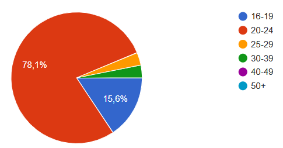

Figura 2: Com qual gênero você se identifica?

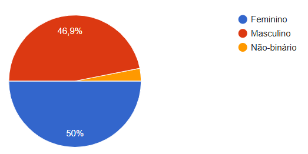

Figura 3: Qual a sua situação ocupacional?

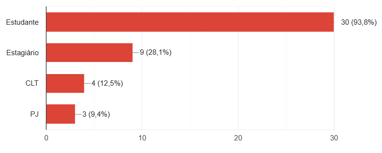

Figura 4: Qual a renda média do seu grupo familiar?

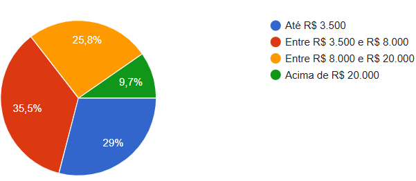

Figura 5: Você possui CNH ativa?

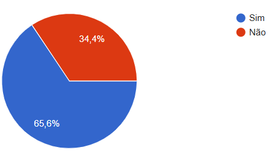

Figura 6: Você possui veículo próprio disponível para ir à faculdade?

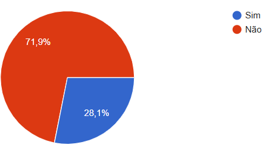

Figura 7: Você estaria disposto a compartilhar carona com alguém que não conhece, desde que fosse estudante da UnB?

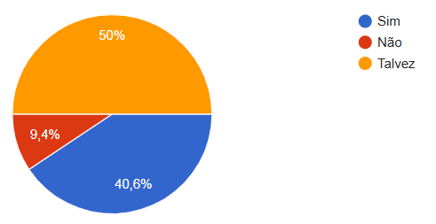

Fonte: [Luiza da Silva Pugas](https://github.com/luizaxx) e [Wanjo Christopher P. Escobar](https://github.com/wChrstphr), 2026

#### Requisitos Elicitados referentes ao Perfil de Usuário (RFU)

Requisitos Funcionais

Tabela 2: Requisitos Funcionais - Parte Usuário

| Código | Requisito Funcional de Usuário | Objetivo | Especificação |
| :--: | :-- | :-- | :-- |
| RFU01 | Informar disponibilidade de CNH e veículo. | Diferenciar potenciais motoristas e passageiros. | Registrar no cadastro o status de CNH ativa e disponibilidade de veículo próprio, com possibilidade de atualização dos dados. |
| RFU02 | Configurar pareamento de carona. | Apoiar regras de pareamento entre usuários. | Definir preferências de pareamento no perfil (ex.: apenas alunos da FCTE ou UnB geral) e registrar disposição para compartilhar carona com usuários fora da rede imediata. |

Fonte: [Wanjo Christopher P. Escobar](https://github.com/wChrstphr), 2026.

---

### 2. Motivação

#### Questionário

Perguntas e Respostas

Figura 8: O que te motivaria a usar um aplicativo de carona entre alunos?

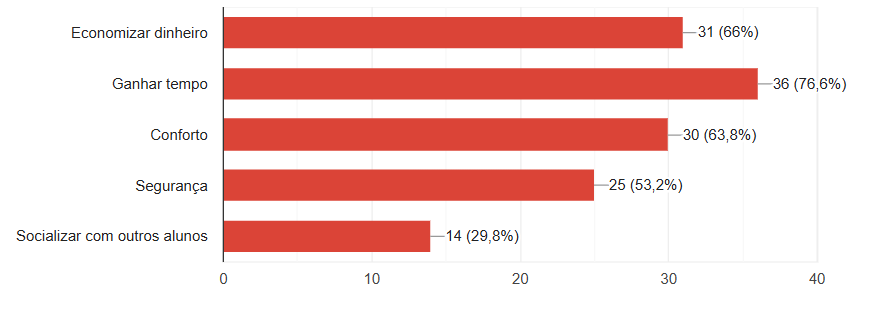

Figura 9: Em quais situações você usaria o app?

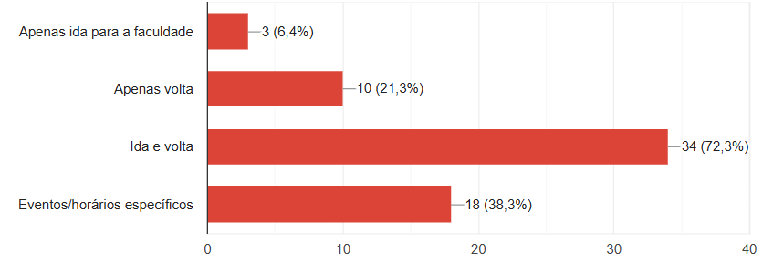

Figura 10: O quanto economizar dinheiro influenciaria sua decisão?

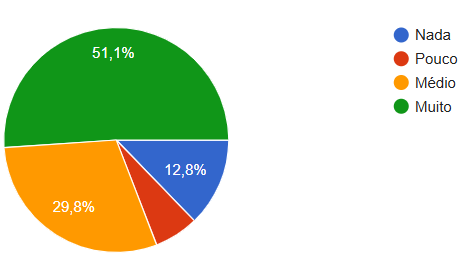

Figura 11: O quanto ganhar tempo influenciaria sua decisão?

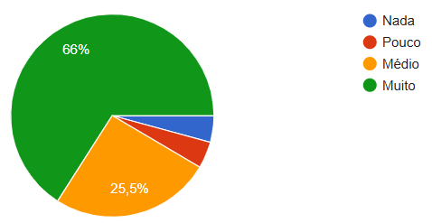

Fonte: Questionário aplicado pela equipe do projeto, 2026.

#### Requisitos Elicitados referentes à Motivação do Usuário (RFM)

Requisitos Funcionais de Motivação

Tabela 4: Requisitos Funcionais - Parte Motivação

| Código | Requisito Funcional | Objetivo | Especificação |
| :--: | :-- | :-- | :-- |
| RFM01 | Selecionar contexto de uso da carona. | Atender diferentes rotinas de deslocamento acadêmico. | Permitir seleção de contexto (ida, volta, ida e volta, eventos/horários específicos) com filtros de busca e oferta por situação de uso. |
| RFM02 | Exibir estimativa de custo e duração. | Reforçar os principais motivadores identificados no questionário. | Apresentar estimativas de custo e tempo no fluxo de visualização e solicitação de carona. |

Fonte: [Wanjo Christopher P. Escobar](https://github.com/wChrstphr), 2026.

Requisitos Não Funcionais

Tabela 5: Requisitos Não Funcionais - Parte Motivação

| Código | Requisito Não Funcional | Objetivo | Especificação |
| :--: | :-- | :-- | :-- |
| RNFM01 | O sistema deve possuir interface simples para consulta e solicitação de caronas. | Reduzir fricção de uso e favorecer adoção inicial. | Fluxos com baixa complexidade de navegação. |

Fonte: [Wanjo Christopher P. Escobar](https://github.com/wChrstphr), 2026.

---

### 3. Segurança

#### Questionário

Perguntas e Respostas

Figura 12: Quais itens aumentariam sua confiança?

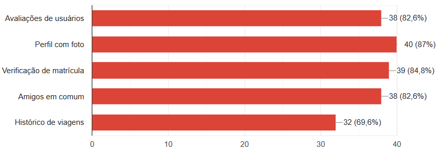

Fonte: Questionário aplicado pela equipe do projeto, 2026.

#### Requisitos Elicitados referentes à Segurança do Usuário (RFS)

Requisitos Funcionais

Tabela 6: Requisitos Funcionais - Parte Segurança

| Código | Requisito Funcional | Objetivo | Especificação |
| :--: | :-- | :-- | :-- |
| RFS01 | Exibir perfil com foto. | Aumentar confiança no processo de escolha de carona. | Exibir foto do usuário no perfil público e nos fluxos de oferta/solicitação de carona. |
| RFS02 | Validar matrícula institucional. | Reforçar segurança e pertencimento ao contexto universitário. | Realizar verificação de vínculo institucional da UnB no processo de cadastro. |
| RFS03 | Permitir avaliação de usuários. | Apoiar decisão por reputação e experiência anterior. | Disponibilizar avaliações e histórico de viagens no perfil para consulta durante a decisão de pareamento. |
| RFS04 | Exibir amigos em comum. | Aumentar percepção de confiança na interação entre usuários. | Indicar conexões sociais compartilhadas no perfil e no fluxo de escolha de carona, quando houver. |

Fonte: [Wanjo Christopher P. Escobar](https://github.com/wChrstphr), 2026.

Requisitos Não Funcionais

Tabela 7: Requisitos Não Funcionais - Parte Segurança

| Código | Requisito Não Funcional | Objetivo | Especificação |
| :--: | :-- | :-- | :-- |
| RNFS01 | Garantir integridade e confiabilidade das informações de perfil e avaliação. | Evitar manipulação indevida de sinais de confiança. | Controle de consistência para dados de reputação e verificação. |
| RNFS02 | Proteger dados sensíveis usados para validação institucional. | Preservar privacidade e segurança do usuário. | Tratamento seguro dos dados de identificação acadêmica. |

Fonte: [Wanjo Christopher P. Escobar](https://github.com/wChrstphr), 2026.

---

### 4. Funcionalidades Desejadas

#### Questionário

Perguntas e Respostas

Figura 13: Quais funcionalidades você considera essenciais?

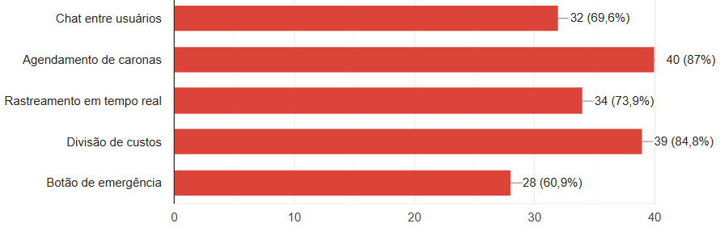

Figura 14: Você prefere caronas:

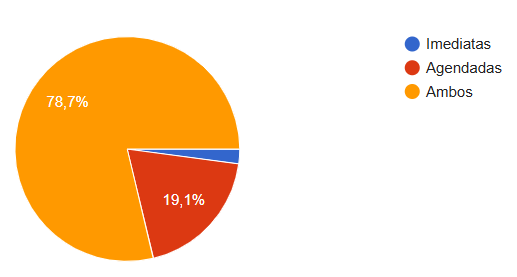

Figura 15: Você gostaria de definir preferências (ex: só motoristas/caronas mulheres)?

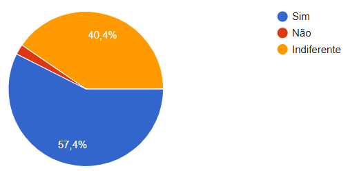

Fonte: Questionário aplicado pela equipe do projeto, 2026.

#### Requisitos Elicitados de Funcionalidades Desejadas (RFF)

Requisitos Funcionais

Tabela 8: Requisitos Funcionais - Parte Funcionalidades Desejadas

| Código | Requisito Funcional | Objetivo | Especificação |
| :--: | :-- | :-- | :-- |
| RFF01 | Agendar caronas. | Atender uso planejado e recorrente da comunidade acadêmica. | Permitir publicação e reserva de caronas com data e horário futuros. |
| RFF02 | Dividir custos da viagem. | Apoiar percepção de justiça e clareza no compartilhamento de despesas. | Oferecer campo de rateio no fluxo de criação e aceite da carona. |
| RFF03 | Rastrear carona em tempo real. | Melhorar previsibilidade e segurança durante o deslocamento. | Exibir acompanhamento de status e localização durante a viagem. |
| RFF04 | Enviar mensagens no chat. | Melhorar comunicação antes e durante a viagem. | Disponibilizar canal de mensageria no contexto da carona criada ou aceita. |
| RFF05 | Acionar botão de emergência. | Apoiar resposta rápida em situações críticas. | Manter ação de emergência acessível durante carona em andamento. |
| RFF06 | Configurar preferências de pareamento. | Aumentar sensação de conforto e adequação do pareamento. | Permitir filtros de preferência no perfil e na busca (ex.: apenas motoristas/caronas mulheres). |
| RFF07 | Selecionar escopo de caronas. | Ajustar o nível de proximidade social desejado pelo usuário. | Aplicar filtros de escopo na descoberta de caronas (mesmo curso, FCTE, UnB). |

Fonte: [Wanjo Christopher P. Escobar](https://github.com/wChrstphr), 2026.

Requisitos Não Funcionais

Tabela 9: Requisitos Não Funcionais - Parte Funcionalidades Desejadas

| Código | Requisito Não Funcional | Objetivo | Especificação |
| :--: | :-- | :-- | :-- |
| RNFF01 | Manter disponibilidade elevada de recursos críticos (chat, rastreamento e emergência). | Evitar falhas em funcionalidades sensíveis à segurança e coordenação da carona. | Confiabilidade operacional durante todo o fluxo da viagem. |
| RNFF02 | Garantir usabilidade em dispositivos móveis para os fluxos principais. | Viabilizar uso cotidiano no contexto de deslocamento. | Interface responsiva e legível em telas móveis. |

Fonte: [Wanjo Christopher P. Escobar](https://github.com/wChrstphr), 2026.

---

### 5. Aspectos Sociais

#### Questionário

Perguntas e Respostas

Figura 16: Você deixaria de usar o app por:

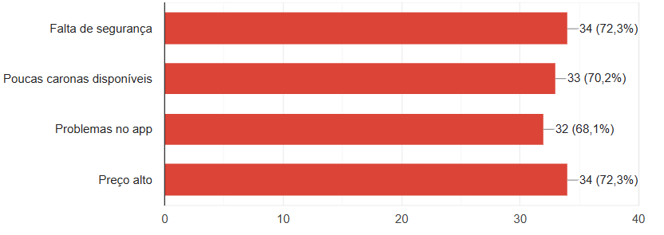

Figura 17: O que faria você baixar o app?

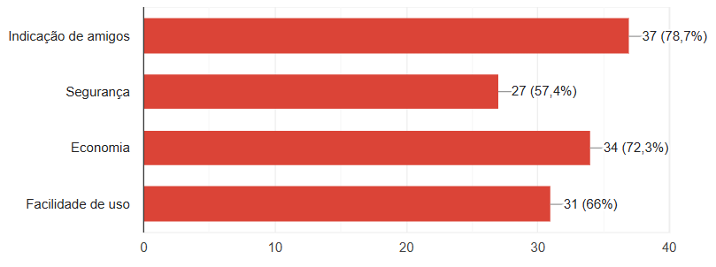

Figura 18: Você se sentiria mais confortável com

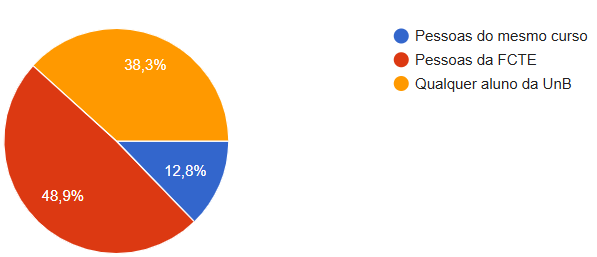

Fonte: Questionário aplicado pela equipe do projeto, 2026.

#### Requisitos Elicitados referentes à Aspectos Sociais (RFA)

Requisitos Funcionais

Tabela 10: Requisitos Funcionais - Parte Aspectos Sociais

| Código | Requisito Funcional | Objetivo | Especificação |
| :--: | :-- | :-- | :-- |
| RFA01 | Permitir indicação de usuários. | Aumentar confiança inicial e estimular entrada de novos usuários. | Implementar fluxo de convite e indicação integrado ao aplicativo. |
| RFA02 | Configurar preferências de conforto social. | Reduzir barreiras de adesão associadas a desconforto social. | Disponibilizar opções de conforto social no perfil e filtros de correspondência no pareamento. |

Fonte: [Wanjo Christopher P. Escobar](https://github.com/wChrstphr), 2026.

Requisitos Não Funcionais

Tabela 11: Requisitos Não Funcionais - Parte Aspectos Sociais

| Código | Requisito Não Funcional | Objetivo | Especificação |
| :--: | :-- | :-- | :-- |
| RNFA01 | Garantir estabilidade da aplicação para reduzir abandono por problemas de uso. | Diminuir desistência motivada por falhas percebidas no app. | Baixa incidência de erros nos fluxos essenciais. |
| RNFA02 | Sustentar experiência de uso confiável em cenários de baixa oferta de caronas. | Reduzir frustração associada à percepção de pouca disponibilidade. | Respostas claras do sistema quando não houver correspondências. |

Fonte: [Wanjo Christopher P. Escobar](https://github.com/wChrstphr), 2026.

---

### 6. Pagamento

#### Questionário

Perguntas e Respostas

Figura 19: O app sugerir preço automático é importante?

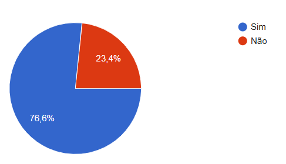

Fonte: Questionário aplicado pela equipe do projeto, 2026.

#### Requisitos Elicitados referentes à Pagamento (RFP)

Requisitos Funcionais

Tabela 12: Requisitos Funcionais - Parte Pagamento

| Código | Requisito Funcional | Objetivo | Especificação |
| :--: | :-- | :-- | :-- |
| RFP01 | Sugerir preço automático da carona. | Apoiar definição de valor com menor esforço para os usuários. | Calcular e exibir valor sugerido no fluxo de criação da carona. |

Fonte: [Wanjo Christopher P. Escobar](https://github.com/wChrstphr), 2026.

Requisitos Não Funcionais

Tabela 13: Requisitos Não Funcionais - Parte Pagamento

| Código | Requisito Não Funcional | Objetivo | Especificação |
| :--: | :-- | :-- | :-- |
| RNFP01 | Garantir transparência na apresentação do preço sugerido. | Evitar percepção de arbitrariedade no valor recomendado. | Critérios de cálculo exibidos de forma compreensível ao usuário. |

Fonte: [Wanjo Christopher P. Escobar](https://github.com/wChrstphr), 2026.

 

## Referências Bibliográficas

> <a id="ref1">1.</a> @article{Eke2019A,
title={A Survey of User Profiling: State-of-the-Art, Challenges, and Solutions},
author={C. Eke and A. Norman and Liyana Shuib and H. F. Nweke},
journal={IEEE Access},
year={2019},
volume={7},
pages={144907-144924},
doi={10.1109/access.2019.2944243}
}

> <a id="ref2">2.</a> IBGE. Pirâmide Etária: Conheça o Brasil. Disponível em: [https://educa.ibge.gov.br/jovens/conheca-o-brasil/populacao/18318-piramide-etaria.html](https://educa.ibge.gov.br/jovens/conheca-o-brasil/populacao/18318-piramide-etaria.html). Acesso em: 28 mar. 2026.

> <a id="ref3">3.</a> IBGE. Indicadores Sociais Mínimos. Disponível em: [https://www.ibge.gov.br/estatisticas/sociais/educacao/17374-indicadores-sociais-minimos.html](https://www.ibge.gov.br/estatisticas/sociais/educacao/17374-indicadores-sociais-minimos.html). Acesso em: 28 mar. 2026.

> <a id="ref4">4.</a> @article{Salminen2021A,
title={A Survey of 15 Years of Data-Driven Persona Development},
author={Joni O. Salminen and Kathleen W. Guan and Soon-gyo Jung and B. Jansen},
journal={International Journal of Human–Computer Interaction},
year={2021},
volume={37},
pages={1685 - 1708},
doi={10.1080/10447318.2021.1908670}
}
## Histórico de Versões

| Versão | Data | Descrição | Autor(es) | Revisor(es) | Detalhes da revisão |
| :----: | :--: | --------- | ----------- | ------ | :---: |
| 1.0 | 28/03/2026 | Criação do documento | [Wanjo Christopher Paraizo Escobar](https://github.com/wChrstphr) | [João Marcos Moraes de Andrade](https://github.com/JJOAOMARCOSS) | Aretefato Revisado |
| 1.1 | 31/03/2026 | Atualização de Objetivo e Metodologia com citações em ordem numérica de aparecimento | [Wanjo Christopher Paraizo Escobar](https://github.com/wChrstphr) | [João Marcos Moraes de Andrade](https://github.com/JJOAOMARCOSS) | Reordenação das referências conforme o fluxo do texto. |
| 1.2 | 31/03/2026 | Arrumando os links |  [João Marcos Moraes de Andrade](https://github.com/JJOAOMARCOSS) | [Wanjo Christopher Paraizo Escobar](https://github.com/wChrstphr) | - |
| 1.3 | 04/04/2026 | Inclusão das categorias do questionário (0 a 18) com requisitos elicitados por parte | [Wanjo Christopher Paraizo Escobar](https://github.com/wChrstphr) | [João Marcos Moraes de Andrade](https://github.com/JJOAOMARCOSS) | Estruturação por partes e tabelas RF/RNF |
| 1.4 | 05/04/2026 | Atualização de referências e finalização do artefato | [Wanjo Christopher Paraizo Escobar](https://github.com/wChrstphr) | [Gabriel Henrique Rodrigues de Lima](https://github.com/gabrielhrlima) | - |