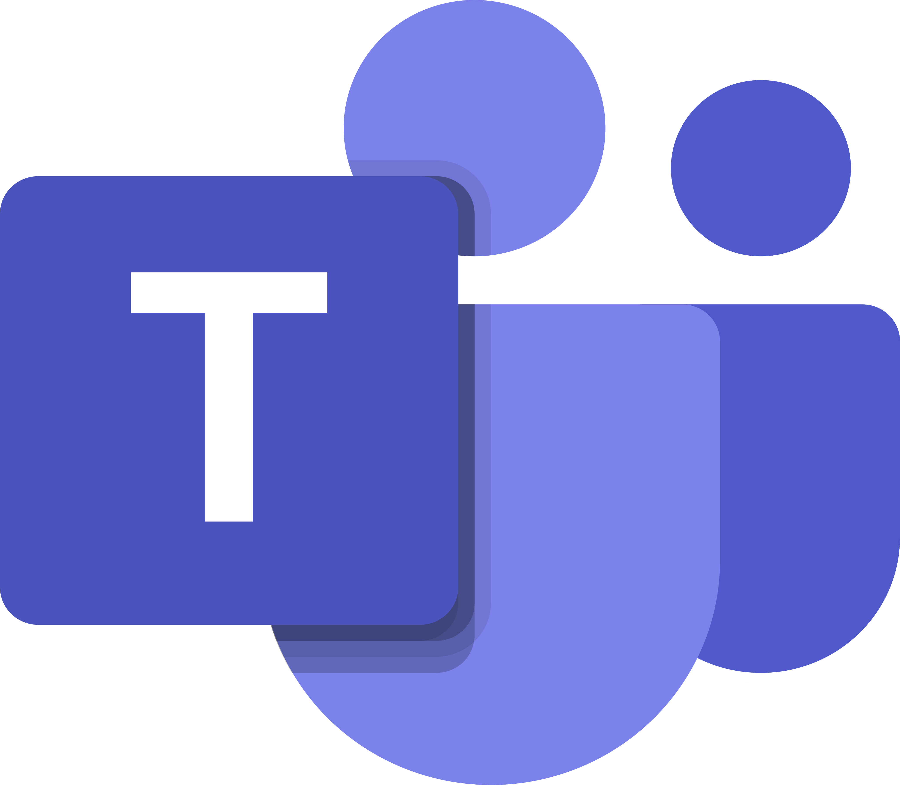
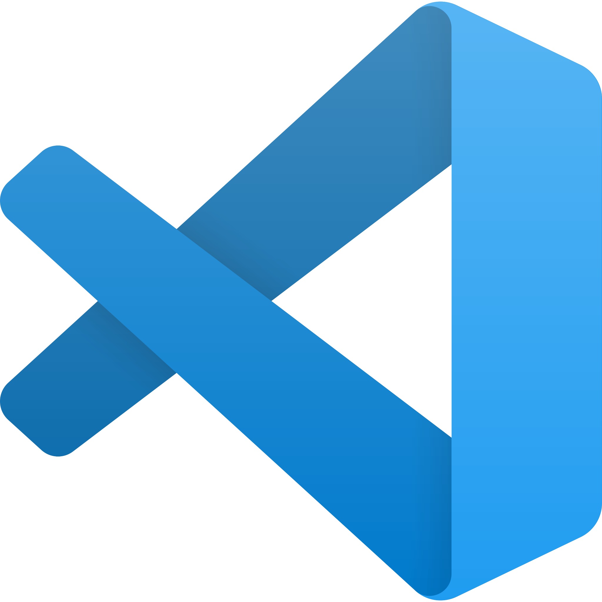
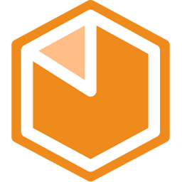

## Ferramentas Utilizadas

Para o desenvolvimento dos artefatos criados neste projeto, foram utilizadas as seguintes ferramentas:

## [GitHub](https://github.com)

O GitHub é uma plataforma de hospedagem de código-fonte que facilita o controle de versão e a colaboração entre desenvolvedores. Com ele, é possível armazenar, gerenciar e compartilhar projetos de software, além de integrar ferramentas para desenvolvimento colaborativo.

Foi utilizado com a finalidade de hospedar todo o projeto, onde os integrantes contribuíram com documentação e código.

## [Discord](https://discord.com)

O Discord é uma plataforma de comunicação digital projetada inicialmente para comunidades de gamers, mas que se expandiu para atender diversos grupos e interesses. Ele combina recursos de voz, vídeo e mensagens de texto em uma interface que permite a criação de servidores – espaços dedicados onde os usuários podem interagir em canais temáticos.

O uso do discord se deu principalmente para reuniões não gravadas e trabalho em conjunto da equipe, agilizando a comunicação.

## [Microsoft Teams](https://www.microsoft.com/pt-br/microsoft-teams/group-chat-software)

O Microsoft Teams é uma plataforma de colaboração e comunicação desenvolvida pela Microsoft, projetada para integrar diversas ferramentas de produtividade e facilitar o trabalho em equipe.

O microsoft teams foi utilizado principalmente para realizar as apresentações e documetação das diversas etapas que o grupo realizou em conjunto.

## [Whatsapp](https://web.whatsapp.com/)

O WhatsApp é um aplicativo de mensagens instantâneas que permite comunicação rápida e eficiente entre usuários através de texto, áudio, vídeo e compartilhamento de arquivos. Desenvolvido com foco em privacidade e criptografia de ponta a ponta, tornou-se uma das plataformas de mensageria mais utilizadas globalmente.

O whatsapp foi utilizado para a comunicação rápida do grupo, facilitando o início da organização e o envio de arquivos.

## [Visual Studio Code](https://code.visualstudio.com)

O Visual Studio Code (VS Code) é um editor de código-fonte desenvolvido pela Microsoft, popular entre desenvolvedores por sua leveza, versatilidade e ampla gama de funcionalidades. Lançado em 2015, o VS Code é de código aberto e gratuito, e se tornou um dos editores mais usados por programadores de diferentes níveis e áreas, desde desenvolvimento web até ciência de dados.

O VS Code foi utilizado como principal ferramenta de desenvimento, tanto para a documentação e a futura aplicação.

## [Figma](https://www.figma.com/)

O Figma é uma ferramenta de design de interface e prototipagem baseada na web que permite a colaboração em tempo real entre equipes. Lançado em 2016, tornou-se popular entre designers e desenvolvedores por suas funcionalidades que facilitam a criação de interfaces de usuário (UI) e experiências de usuário (UX).

O Figma foi utilizado na etapa de **Design Sprint** para:
- elaboração do **Rich Picture geral**, do **Storyboard geral** e **Brainstorming**;  
- desenvolvimento do **protótipo de alta fidelidade**.

## [Bizagi Modeler](https://www.bizagi.com/pt/plataforma/modeler)

O Bizagi é uma plataforma de Business Process Management (BPM) que permite às empresas modelar, automatizar e otimizar seus processos de negócios. Fundada em 1989, a ferramenta se destaca por proporcionar uma abordagem intuitiva e visual para o mapeamento de processos, facilitando tanto para equipes técnicas quanto para usuários de negócios.

Foi utilizado para produzir os diagramas em BPMN que apresentam a metodologia adaptada e utilizada pela equipe.

## [GitHub Projects](https://github.com/features/project-management)

O GitHub Projects é uma ferramenta nativa do GitHub que oferece gerenciamento de projetos integrado diretamente ao repositório, permitindo que equipes organizem tarefas, acompanhem o progresso e gerenciem fluxos de trabalho de forma visual através de quadros Kanban.

Foi utilizado para organizar e gerenciar as atividades do projeto, permitindo uma visualização clara do progresso das tarefas, priorização de atividades e coordenação das entregas de cada módulo do projeto.

## [Miro](https://miro.com)

O **Miro** é uma ferramenta de quadro colaborativo online (whiteboard) que permite criar e organizar diagramas, fluxos e materiais visuais de forma colaborativa e em tempo real. É amplamente utilizada para atividades de brainstorming, planejamento e modelagem.

No projeto, o Miro foi utilizado como apoio na etapa de **Modelagem BPMN**, auxiliando na organização visual das ideias e na consolidação do conteúdo antes (e durante) a produção dos diagramas finais.

---

## Histórico de Versões

| Versão | Data | Descrição | Autor(es) | Revisor(es) | Detalhes da revisão |
| :----: | :--: | --------- | ----------- | ------ | :---: |
| 1.0  | 29/03/2026 | Criação do documento[#8](https://github.com/UnBArqDsw2026-1-Turma02/2026.1-T02-G7_CaronaAmigaFCTE_Entrega_01/issues/8) | [João Marcos Moraes de Andrade](https://github.com/JJOAOMARCOSS) | [Wanjo Christopher Paraizo Escobar](https://github.com/wChrstphr) | Artefato revisado |