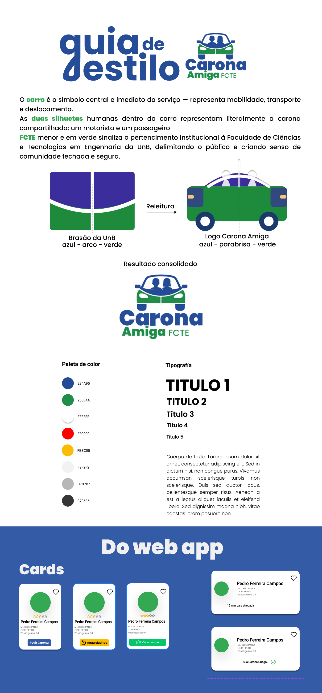

# Guia de Estilo

## Introdução

O **guia de estilo** (style guide) consolida padrões visuais e de interface para manter consistência durante o desenvolvimento. Ele reúne definições como **paleta de cores**, **tipografia**, **componentes**, **ícones** e **uso de marca**, reduzindo ambiguidades e acelerando a prototipação e a implementação.

## Metodologia

A construção deste guia considerou recomendações de padronização e consistência visual presentes em materiais de IHC (Barbosa e Silva). O artefato foi elaborado no **Figma**, ferramenta também utilizada em outras etapas de design do projeto.

- Ferramenta utilizada: **[Figma](Base/5-Iniciativas-Extras/ferramentas-utilizadas.md)**

## Acesso ao arquivo no Figma

- Link direto: **[Carona Amiga — FCTE (Figma)](https://www.figma.com/design/ujPAQzypxGliC9h0f9o8dl/Carona-Amiga---FCTE?node-id=157-2800&t=iIihYuVVfJNbBy4C-4)**

?> **Nota:** Se o embed abaixo não carregar (bloqueio de terceiros/cookies), use o link direto acima para abrir no Figma.

## Guia de estilo (prévia)

## Guia de estilo (embed)

  <iframe
    style="border: 1px solid rgba(0, 0, 0, 0.1); border-radius: 10px;"
    width="100%"
    height="650"
    src="https://www.figma.com/embed?embed_host=share&url=https%3A%2F%2Fwww.figma.com%2Fdesign%2FujPAQzypxGliC9h0f9o8dl%2FCarona-Amiga---FCTE%3Fnode-id%3D157-2800%26t%3DiIihYuVVfJNbBy4C-4"
    allowfullscreen
  ></iframe>

Fonte: [João Marcos](https://github.com/JJOAOMARCOSS), [Luiza da Silva](https://github.com/luizaxx) e [Wanjo Christopher](https://github.com/wChrstphr), 2026.

---

## Referências Bibliográficas

> BARBOSA, S. D. J.; SILVA, B. S. **Interação Humano-Computador e Experiência do Usuário**. 2021. ISBN: 978-65-00-19677-1.

## Histórico de Versões

| Versão | Data | Descrição | Autor(es) | Revisor(es) | Detalhes da revisão |
| :----: | :--: | --------- | ----------- | ------ | :---: |
| 1.0  | 05/04/2026 | Criação do documento [#10](https://github.com/UnBArqDsw2026-1-Turma02/2026.1-T02-G7_CaronaAmigaFCTE_Entrega_01/issues/10) | [João Marcos Moraes de Andrade](https://github.com/JJOAOMARCOSS) e [Luiza da Silva](https://github.com/luizaxx)  | [Wanjo Christopher](https://github.com/wChrstphr) e [Karoline Luz da Conceição](https://github.com/KarolineLuz) | Aretefato revisado |